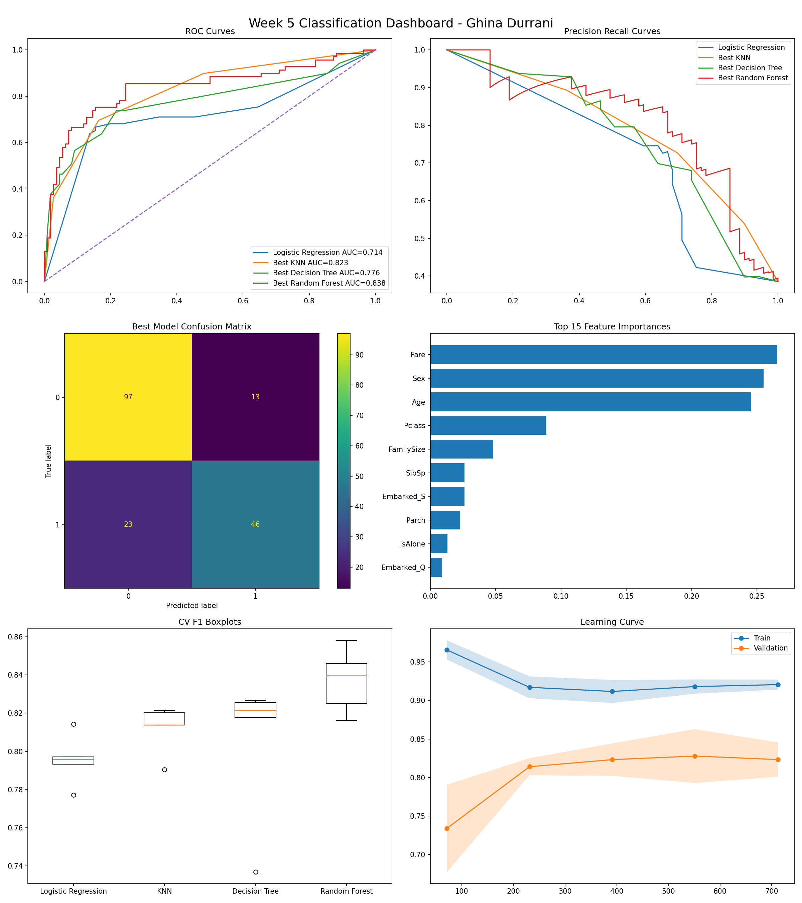

# AIML-Internship-Week5-GhinaDurrani

## Overview

This project was completed as part of the AI/ML Internship Week 5 task on Supervised Learning Classification. The Titanic dataset was used to predict passenger survival using multiple machine learning classification models.

---

## Dataset

- Dataset: Titanic — Machine Learning from Disaster
- Source: Kaggle
- Rows: 891
- Target Variable: Survived

### Features Used
- Pclass
- Sex
- Age
- SibSp
- Parch
- Fare
- Embarked
- FamilySize
- IsAlone

---

## Models Trained

1. Logistic Regression  
2. K-Nearest Neighbours (KNN)  
3. Decision Tree Classifier  
4. Random Forest Classifier  

---

## Best Model

### Random Forest Classifier

| Metric | Score |
|---|---|
| Test F1 Score | 0.8371 |
| Test ROC-AUC | 0.8762 |

Random Forest achieved the best overall classification performance with strong generalization and stable cross-validation results.

---

## Feature Engineering

- Filled missing Age values using median
- Filled missing Embarked values using mode
- Encoded categorical variables
- Applied log1p transformation on Fare
- Created FamilySize feature
- Created IsAlone feature
- Standardized features using StandardScaler

---

## Tools & Libraries Used

- Python
- Pandas
- NumPy
- Matplotlib
- Scikit-learn
- Joblib
- SciPy

---

## Files Included

- `week5_notebook.ipynb`
- `week5_dashboard.png`
- `week5_best_model.pkl`
- `README.md`

---

## Dashboard Preview

